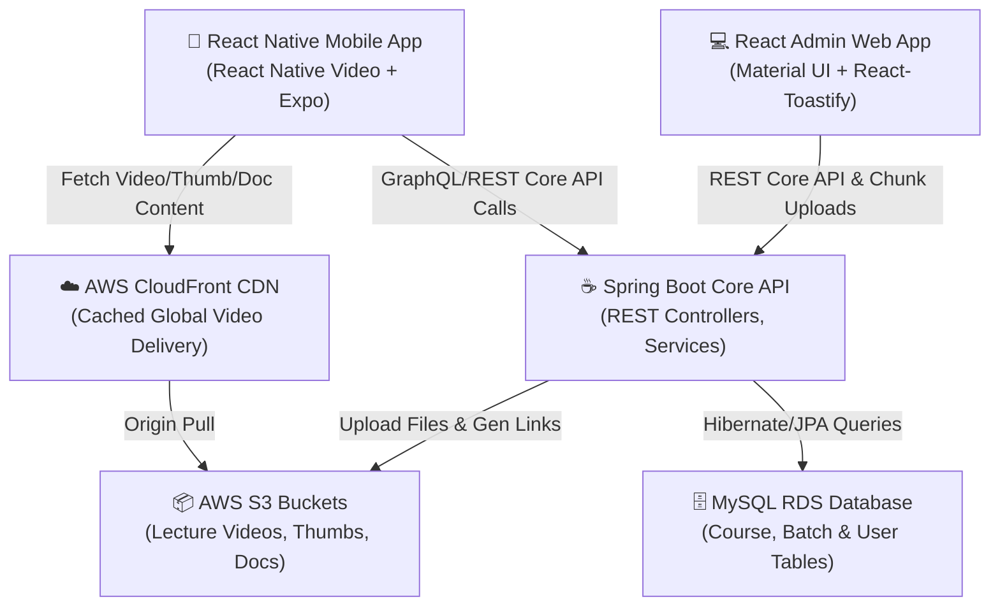
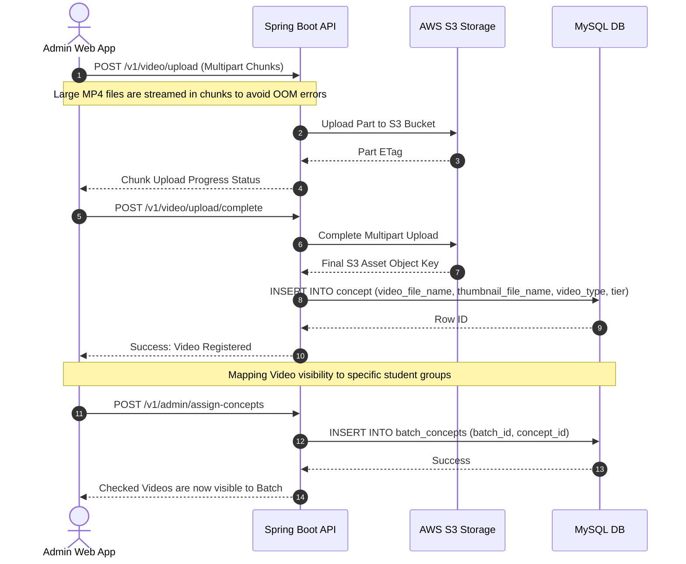
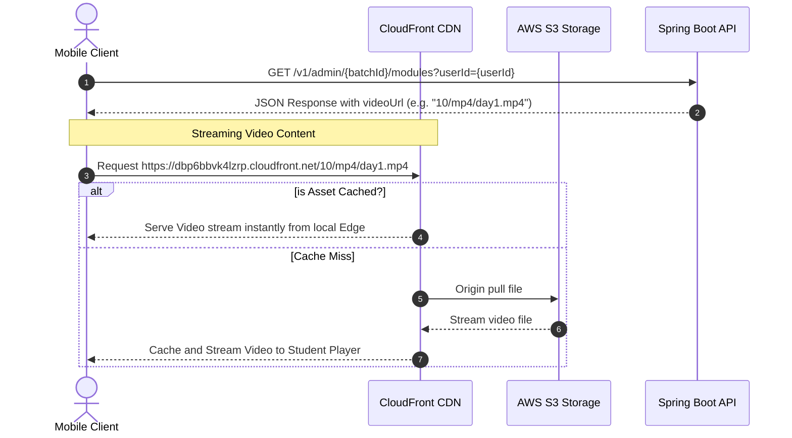
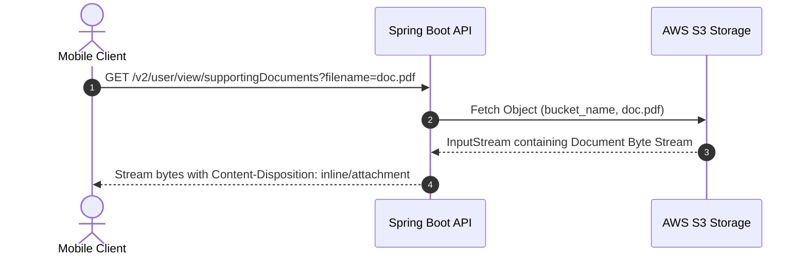
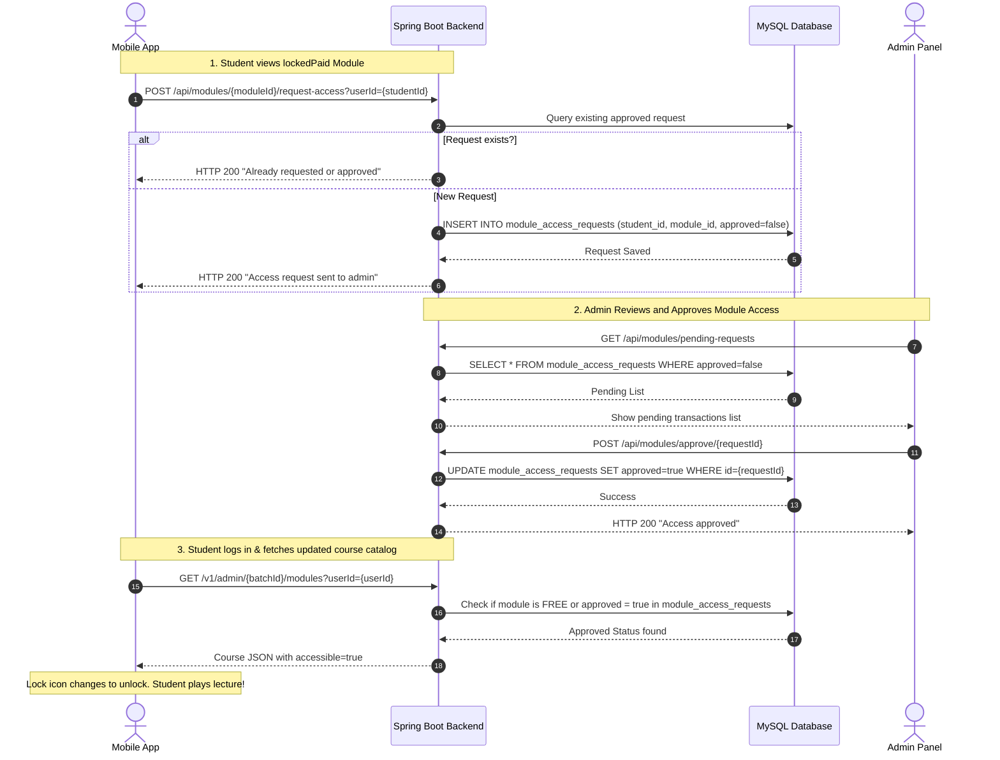

# ConnectThrive System Architecture & Complete Flow Analysis

Welcome to the **ConnectThrive Handover & Technical Maintenance Document**. This guide provides an end-to-end technical breakdown of the ConnectThrive ecosystem, which is designed to teach students Oracle Fusion Financials. It covers the mobile application, admin panel, Spring Boot API layer, and AWS cloud infrastructure.

---

## 1. System Architecture Overview

The ConnectThrive application uses a modern multi-tier architecture to securely and efficiently deliver high-definition lecture videos, thumbnails, and supporting documents to students.

### Architecture Pillars

| Component | Technology Stack | Core Responsibility |
| :--- | :--- | :--- |
| **Mobile Client** | React Native, Expo, react-native-video | Provides students course catalogs, video players with custom gestures, supporting materials, and practice instance links. |
| **Admin Web App** | React.js, Material UI, Axios | Allows administrators to upload high-resolution lecture videos, manage student batches, toggles, and practice instances. |
| **Backend API** | Spring Boot, Hibernate, JPA, Java 21 | Handles business logic, course structure, database operations, user accounts, and S3 multipart upload delegation. |
| **Storage & Delivery** | AWS S3, AWS CloudFront CDN | Secure object storage and low-latency worldwide delivery for large video MP4 files, thumbnails, and document PDFs. |
| **Database** | MySQL RDS | Relational database containing course schemas, user progress, transaction states, and authentication mappings. |

---

## 2. Core Modules & Component Mapping

Below is the directory mapping for all three repositories, showing their logical divisions.

### A. Spring Boot Backend Code Structure (`connectthrive_backend`)
*   **`com.connectthrive.connectthrive.adminlatest`**: Handles newer admin features.
    *   `controller/BatchController.java`: Endpoints for managing student batches and mapping concepts to batches.
    *   `controller/ModuleAccessController.java`: Endpoints for managing access requests and approvals.
    *   `service/BatchService.java`: Business logic relating to fetching student-specific modules and batch assignments.
    *   `service/ModuleAccessService.java`: Logic for checking, requesting, and approving Paid course access.
*   **`com.connectthrive.connectthrive.video`**: Handles multimedia processing and uploads.
    *   `VideoUploadController.java`: Handles chunk-based multipart uploads to AWS S3.
*   **`com.connectthrive.connectthrive.user`**: Handles student entities, profiles, authentication, and signup OTPs.
    *   `LoginController.java`: Direct controllers for OTP request, signup verification, and logins.

### B. Admin Web App Component Mapping (`connectthrive_admin_web_app`)
*   **`src/components/Dashboard.js`**: Core navigation dashboard.
*   **`src/components/UploadVideo.js`**: Handles video details, multipart file uploads, thumbnail file selection, and video-type configurations.
*   **`src/components/BatchVideos.js`**: Connects concepts/videos to individual student batches using interactive checkboxes.
*   **`src/components/Batches.js`**: Create and modify user classes/batches.
*   **`src/components/Modules.js`**: Controls course modularization and tier states (`FREE` vs `PAID`).
*   **`src/components/Instance.js`**: Allows the admin to update active Oracle Fusion practice credentials.

### C. Mobile App Screens (`ConnectThrive`)
*   **`screens/CoursesScreen.tsx`**: Renders course listings, locks paid chapters, and registers access request taps.
*   **`screens/ConceptVideoScreen.tsx`**: Implements custom video streaming, horizontal seeking, double-tap skip overlays, and lists active concepts.

---

## 3. End-to-End Core Flows

This section breaks down the application's most critical operational flows.

---

### Flow A: Lecture Video Upload & Visibility Controls

This sequence allows admins to securely upload raw media and control which student groups can view it.

#### Key Technical Implementation Details:
1.  **S3 Chunk-based Multipart Upload**: Designed specifically for large high-definition video assets. Instead of uploading a large file as a single HTTP request, `VideoUploadController.java` utilizes the AWS Java SDK to break files into 5MB chunks. These are uploaded asynchronously to AWS S3, guaranteeing stability and recovery in case of transient network errors.
2.  **Flexible Batch Mapping**: Under `BatchVideos.js`, when an admin expands a module Accordion, they see a list of lecture concepts. Selecting/deselecting checkboxes triggers a call to `/assign-concepts` on the backend. This directly updates the `batch_concepts` link table, making the video instantly available or hidden for that student batch.

---

### Flow B: Video Playback, CDN & Skip Handler

Student video viewing is optimized via CDN caching and intuitive player gestures.

#### Gesture Playback Controls in `ConceptVideoScreen.tsx`:
*   **Double Tap to Skip**: The custom video overlay partitions the player into three horizontal zones (Left, Center, Right):
    *   *Double tapping the Left zone* triggers `seekBy(-10)` to skip backward 10 seconds.
    *   *Double tapping the Right zone* triggers `seekBy(10)` to skip forward 10 seconds.
    *   A responsive skip overlay (`Animated.View`) fades in, showing `10s`, `20s`, or `30s` dynamically as students tap repeatedly.
*   **Horizontal Scrubbing**: Students can drag the custom `@react-native-community/slider` smoothly. The player invokes `onSlidingStart` to temporarily freeze the auto-hide controls timer and smoothly transitions video timestamps via `videoRef.current.seek()`.

---

### Flow C: Supporting Document Retrieval

Students can download or preview supporting PDFs and documents accompanying each concept lecture.

1.  **Secure Storage**: Document PDFs are stored privately in S3.
2.  **Streaming Endpoint**: The backend acts as a secure gateway, validating the user's active session, fetching the stream from AWS S3, and streaming it directly to the mobile device.

---

### Flow D: Transaction Flow - Request and Approval Loop (Access Request)

For paid Oracle Fusion Financial modules, a secure request-and-approval transaction flow is enforced to prevent unpaid media leakage.

---

## 4. Key Database Schema & Data Models

ConnectThrive manages relations through a structured, normalized MySQL database. Below are the primary entities and mappings:

### 1. `course` Table
Stores the courses available in the system.
*   `id` (BIGINT, PK): Course Unique Identifier.
*   `name` (VARCHAR): Name of the course (e.g., *Oracle Fusion Financials*).

### 2. `batch` Table
Groups students into distinct cohorts or groups (e.g., morning batches, evening batches).
*   `id` (BIGINT, PK): Batch Identifier.
*   `name` (VARCHAR): Name of the batch (e.g., *Regular Batch*).

### 3. `course_module` Table
Splits courses into logically independent topics or segments.
*   `id` (BIGINT, PK): Module Identifier.
*   `name` (VARCHAR): Topic name (e.g., *Accounts Payable (AP)*).
*   `tier` (VARCHAR): Access level flag (`FREE` or `PAID`).
*   `description` (VARCHAR): Module summary.
*   `course_id` (BIGINT, FK): References `course(id)`.

### 4. `concept` Table
Stores individual video lectures, corresponding streaming locations, and thumbnail resources.
*   `id` (BIGINT, PK): Lecture Identifier.
*   `title` (VARCHAR): Lecture Title.
*   `video_file_name` (VARCHAR): AWS S3 Object Key for the MP4 video asset.
*   `thumbnail_file_name` (VARCHAR): AWS S3 Object Key for the PNG/JPEG thumbnail.
*   `video_type` (VARCHAR): Video partition type (`Setup Videos` or `Transaction Videos`).
*   `module_id` (BIGINT, FK): References `course_module(id)`.

### 5. `batch_concepts` Link Table
Maps concept visibility directly to student cohorts. If a concept-batch record is present here, students in that batch can view the concept.
*   `batch_id` (BIGINT, FK): References `batch(id)`.
*   `concept_id` (BIGINT, FK): References `concept(id)`.

### 6. `module_access_requests` Table
Tracks access purchases and admin approval flags for Paid course modules.
*   `id` (BIGINT, PK): Request ID.
*   `student_id` (BIGINT, FK): References `users(id)`.
*   `module_id` (BIGINT, FK): References `course_module(id)`.
*   `approved` (BOOLEAN): Approval/Purchase status indicator.
*   `requested_at` (DATETIME): Timestamp of request.

---

## 5. Summary of Diagnostic Tools

The ex-employee left several extremely useful automation and check scripts in the root directory to assist in diagnostics:

1.  **`seed_db.py`**:
    *   **Purpose**: Resets and populates the database with clean seed data (e.g., default `Oracle Fusion Financials` course, `Regular Batch` cohort, `Accounts Payable (AP)` module, and standard interview lecture concepts).
    *   **Usage**: Run `python seed_db.py` to restore a standard state.
2.  **`check_prod_counts.py`**:
    *   **Purpose**: Instantly queries the production RDS instance (`35.154.96.221`) and outputs the current counts of live modules and concepts.
    *   **Usage**: Run `python check_prod_counts.py`.
3.  **`check_prod_otp.py`**:
    *   **Purpose**: Retrieves the latest active signup/verification OTP for a given mobile number. Extremely helpful when simulating student signups or validating password reset mechanisms.
    *   **Usage**: Run `python check_prod_otp.py <mobile_number>`.

---

## 6. Handover Verification Checklist

For upcoming features and ongoing system maintenance, use the following operational checklist:

*   [x] **S3 Storage Verification**: Confirm that chunk-based video files and thumbnail media are properly mapped inside `aws-s3-config` parameters.
*   [x] **CDN Caching Strategy**: Confirm that CloudFront distribution headers allow video-seeking request ranges (`Accept-Ranges: bytes`).
*   [x] **Tier Permissions Verification**: When implementing new paid lectures, ensure the module tier is set to `PAID` via the admin dashboard, and verify that the lock icon displays properly on the mobile client.
*   [x] **Oracle Practice Instance Setup**: Verify that practice credentials configured in the admin dashboard sync seamlessly to active practice students.
